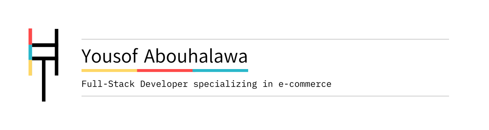

  <picture>
    <source media="(prefers-color-scheme: dark)" srcset="./assets/profile-banner.svg">
    
  </picture>

   

  <h1>Yousof, here.</h1>

  
<strong>Full Stack Developer specializing in e-commerce.</strong>

  

    I build commerce software, React Native libraries, web apps, backend systems, integrations, and deployment workflows.
  

  

    MBBS student at Suez Canal University, Ismailia, Egypt. 
    Current status: shipping software and mostly just suffering academically.
  

---

### Shape of the work

<table>
  <tr>
    <td align="center"><strong>Commerce</strong> Storefronts, admin tools, Medusa.js, Shopify</td>
    <td align="center"><strong>React Native</strong> Native iOS/Android UI, Expo, reusable libraries</td>
    <td align="center"><strong>Backend</strong> APIs, data models, integrations, NestJS</td>
    <td align="center"><strong>Delivery</strong> Docker, Ubuntu Server, deployment, debugging</td>
  </tr>
</table>

 

<code>TypeScript</code> · <code>JavaScript</code> · <code>React</code> · <code>Next.js</code> · <code>SvelteKit</code> · <code>React Native</code> · <code>Expo</code> · <code>Medusa.js</code> · <code>Shopify</code> · <code>NestJS</code> · <code>Docker</code> · <code>Git</code>

---

### Open source

<a href="https://github.com/yousofabouhalawa/sveltekit-shopify-storefront-starter"><strong>sveltekit-shopify-storefront-starter</strong></a> ·
<a href="https://github.com/yousofabouhalawa/react-native-alert"><strong>react-native-alert</strong></a> ·
<a href="https://github.com/yousofabouhalawa/react-native-snack-bar"><strong>react-native-snack-bar</strong></a> ·
<a href="https://github.com/yousofabouhalawa/react-native-editable-list"><strong>react-native-editable-list</strong></a>

---

### Find me

